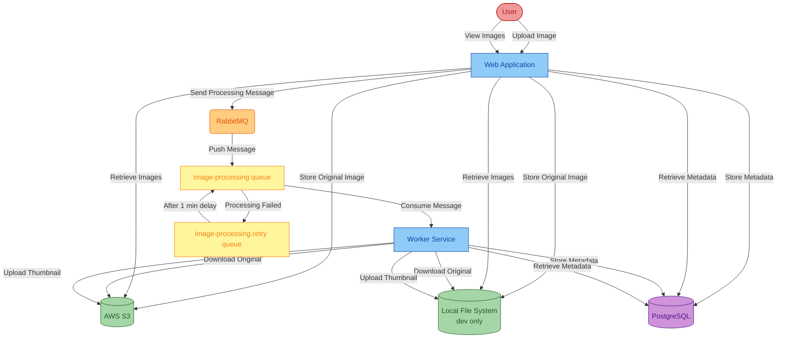

# Asset Manager

This document serves as a comprehensive workshop guide that will walk you through the process of migrating a Java application to Azure using GitHub Copilot app modernization. The workshop covers assessment, Java/framework upgrades, migration to Azure services, containerization, and deployment.

**What the modernization Process Will Do:**
The modernization will transform your application from the outdated technologies to a modern Azure-native solution. This includes upgrading from Java 8 to Java 21, migrating from Spring Boot 2.x to 3.x, replacing AWS S3 with Azure Blob Storage, switching from RabbitMQ to Azure Service Bus, migrating to Azure Database for PostgreSQL, implementing managed identity authentication, adding health checks, containerizing the applications, and preparing them for cloud deployment with proper monitoring.

## Table of Contents

- [Overview](#overview)
- [Current Architecture](#current-architecture)
- [Run Locally](#run-locally)
- [App Modernization](#app-modernization)
  - [Install GitHub Copilot app modernization](#install-github-copilot-app-modernization)
  - [Assess Your Java Application](#assess-your-java-application)
  - [Upgrade Runtime & Frameworks](#upgrade-runtime--frameworks)
  - [Migrate to Azure Database for PostgreSQL Flexible Server using Predefined Tasks](#migrate-to-azure-database-for-postgresql-flexible-server-using-predefined-tasks)
  - [Migrate to Azure Blob Storage using Predefined Tasks](#migrate-to-azure-blob-storage-using-predefined-tasks)
  - [Migrate to Azure Service Bus using Predefined Tasks](#migrate-to-azure-service-bus-using-predefined-tasks)
  - [Expose health endpoints using Custom Tasks](#expose-health-endpoints-using-custom-tasks)
  - [Containerize Applications](#containerize-applications)
  - [Deploy to Azure](#deploy-to-azure)

## Overview

The [main](https://github.com/Azure-Samples/java-migration-copilot-samples/tree/main/asset-manager) branch of the asset-manager project is the original state before being migrated to Azure services. It is organized as follows:
* AWS S3 for image storage, using password-based authentication (access key/secret key)
* RabbitMQ for message queuing, using password-based authentication
* PostgreSQL database for metadata storage, using password-based authentication

In this workshop, you will use the **GitHub Copilot app modernization** extension to assess, upgrade, migrate, and finally deploy the project to Azure.

**Time Estimates:**
The complete workshop takes approximately **2 hours** to complete. Here's the breakdown for each major step:
- **Assess Your Java Application**: ~5 minutes
- **Upgrade Runtime & Frameworks**: ~10 minutes
- **Migrate to Azure Database for PostgreSQL**: ~15 minutes
- **Migrate to Azure Blob Storage**: ~15 minutes
- **Migrate to Azure Service Bus**: ~15 minutes
- **Expose Health Endpoints**: ~15 minutes
- **Containerize Applications**: ~5 minutes
- **Deploy to Azure**: ~40 minutes

There are 3 branches we have prepared for you in case you have any problems with any steps in this workshop:
* [main](https://github.com/Azure-Samples/java-migration-copilot-samples/tree/main/asset-manager): The original state of the asset-manager application.
* [workshop/java-upgrade](https://github.com/Azure-Samples/java-migration-copilot-samples/tree/workshop/java-upgrade/asset-manager): The project state after assessment and Java upgrading steps.
* [workshop/expected](https://github.com/Azure-Samples/java-migration-copilot-samples/tree/workshop/expected/asset-manager): The project state after assessment, Java upgrading, and migration steps.
* [workshop/deployment-expected](https://github.com/Azure-Samples/java-migration-copilot-samples/tree/workshop/deployment-expected/asset-manager): The project state after containerization and deployment steps.

## Current Architecture

Password-based authentication

## Run Locally

Clone the repository and open the asset-manager folder to run the current project locally:

```bash
git clone https://github.com/Azure-Samples/java-migration-copilot-samples.git
cd java-migration-copilot-samples/asset-manager
```

**Prerequisites**: 
- [JDK 8](https://learn.microsoft.com/en-us/java/openjdk/download#openjdk-8): Required for running the initial application locally.
- [Maven 3.6.0+](https://maven.apache.org/install.html): Required to build the application locally.
- [Docker](https://docs.docker.com/desktop/): Required for running the application locally.

Run the following commands to start the apps locally. This will:
* Use the local file system instead of S3 to store images
* Launch RabbitMQ and PostgreSQL using Docker

Windows:

```batch
scripts\startapp.cmd
```

Linux:

```bash
scripts/startapp.sh
```

To stop, run `stopapp.cmd` or `stopapp.sh` in the `scripts` directory.

## App Modernization

The following sections guide you through the process of modernizing the sample Java application `asset-manager` to Azure using GitHub Copilot app modernization.

**Prerequisites**: 
- A GitHub account with [GitHub Copilot](https://github.com/features/copilot) enabled. A Pro, Pro+, Business, or Enterprise plan is required.
- One of the following IDEs:
  - The latest version of [Visual Studio Code](https://code.visualstudio.com/). Must be version 1.101 or later.
    - [GitHub Copilot in Visual Studio Code](https://code.visualstudio.com/docs/copilot/overview). For setup instructions, see [Set up GitHub Copilot in Visual Studio Code](https://code.visualstudio.com/docs/copilot/setup). Be sure to sign in to your GitHub account within Visual Studio Code.
    - [GitHub Copilot app modernization](https://marketplace.visualstudio.com/items?itemName=vscjava.migrate-java-to-azure). Restart Visual Studio Code after installation.
  - The latest version of [IntelliJ IDEA](https://www.jetbrains.com/idea/download). Must be version 2023.3 or later.
    - [GitHub Copilot](https://plugins.jetbrains.com/plugin/17718-github-copilot). Must be version 1.5.59 or later. For more instructions, see [Set up GitHub Copilot in IntelliJ IDEA](https://docs.github.com/en/copilot/get-started/quickstart). Be sure to sign in to your GitHub account within IntelliJ IDEA.
    - [GitHub Copilot app modernization](https://plugins.jetbrains.com/plugin/28791-github-copilot-app-modernization). Restart IntelliJ IDEA after installation. If you don't have GitHub Copilot installed, you can install GitHub Copilot app modernization directly.
    - For more efficient use of Copilot in app modernization: in the IntelliJ IDEA settings, select the **Tools** > **GitHub Copilot** configuration window, and then select **Auto-approve** and **Trust MCP Tool Annotations**. For more information, see [Configure settings for GitHub Copilot app modernization to optimize the experience for IntelliJ](configure-settings-intellij.md).
- [Java JDK](/java/openjdk/download) for both the source and target JDK versions.
- [Maven](https://maven.apache.org/download.cgi) or [Gradle](https://gradle.org/install/) to build Java projects.
- A Git-managed Java project using Maven or Gradle.
- For Maven-based projects: access to the public Maven Central repository.
- In the Visual Studio Code settings, make sure `chat.extensionTools.enabled` is set to `true`. This setting might be controlled by your organization.

> Note: If you're using Gradle, only the Gradle wrapper version 5+ is supported. The Kotlin Domain Specific Language (DSL) isn't supported.
>
> The function `My Tasks` isn't supported yet for IntelliJ IDEA.

### Install GitHub Copilot app modernization

In VSCode, open the Extensions view from the Activity Bar, search for the `GitHub Copilot app modernization` extension in the marketplace. Click the Install button for the extension. After installation completes, you should see a notification in the bottom-right corner of VSCode confirming success.

**Alternative: IntelliJ IDEA**
Alternatively, you can use IntelliJ IDEA. Open **File** > **Settings** (or **IntelliJ IDEA** > **Preferences** on macOS), navigate to **Plugins** > **Marketplace**, search for `GitHub Copilot app modernization`, and click **Install**. Restart IntelliJ IDEA if prompted.

### Assess Your Java Application

The first step is to assess the sample Java application `asset-manager`. The assessment provides insights into the application's readiness for migration to Azure.

1. Open VS Code with all the prerequisites installed for the asset manager by changing the directory to the `asset-manager` directory and running `code .` in that directory.
1. Open the `GitHub Copilot app modernization` extension.
1. In the **QUICKSTART** view, click the **Migrate to Azure** button to trigger app assessment.

   

1. Wait for the assessment to be completed and the report to be generated.
1. Review the **Assessment Report**. Select the **Issues** tab to view the proposed solutions for the issues identified in the report.

### Upgrade Runtime & Frameworks

1. In the **Java Upgrade** table at the bottom of the **Issues** tab, click the **Run Task** button of the first entry **Java Version Upgrade**.

    
1. After clicking the **Run Task** button, the Copilot Chat panel will open with Agent Mode. The agent will check out a new branch and start upgrading the JDK version and Spring/Spring Boot framework. Click **Allow** for any requests from the agent.

> Note: The upgrading tool also supports upgrading to JDK 25 (the latest LTS version). To do this, click on the generated chat message, edit the target Java version to 25, and then click **Send** to apply the change.

### Migrate to Azure Database for PostgreSQL Flexible Server using Predefined Tasks

Then you can migrate the sample Java application `asset-manager` to Azure.

> Note: We've set up a [workshop/java-upgrade](https://github.com/Azure-Samples/java-migration-copilot-samples/tree/workshop/java-upgrade/asset-manager) branch where the Java upgrade has already been completed. Feel free to switch to this branch if you'd like to skip ahead and continue with the rest of the workshop.

1. For this workshop, select **Migrate to Azure Database for PostgreSQL (Spring)** in the Solution list, then click **Run Task**.

   
1. After clicking the **Run Task** button in the Assessment Report, the Copilot Chat panel will open with Agent Mode.
1. The Copilot Agent will first analyze the project and generate a migration plan.
1. After the plan is generated, Copilot Chat will stop with two generated files: **plan.md** and **progress.md**. If prompted, enter "Continue" or "Proceed" in the chat to confirm and execute the plan.
1. When the code is migrated, the extension will prepare the **CVE Validation and Fixing** process. Click **Allow** to proceed.
1. Review the proposed code changes and click **Keep** to apply them.

### Migrate to Azure Blob Storage using Predefined Tasks

1. Click the **Run Task** in the Assessment Report, on the right of the row `Storage Migration (AWS S3)` - `Migrate from AWS S3 to Azure Blob Storage`.
1. The following steps are the same as the above PostgreSQL server migration.

### Migrate to Azure Service Bus using Predefined Tasks

1. Click the **Run Task** in the Assessment Report, on the right of the row `Messaging Service Migration (Spring AMQP RabbitMQ)` - `Migrate from RabbitMQ(AMQP) to Azure Service Bus`.
1. The following steps are the same as the above PostgreSQL server migration.

### Expose health endpoints using Custom Tasks

In this section, you will use custom tasks to expose health endpoints for your applications instead of writing code yourself. The following steps demonstrate how to generate custom tasks based on external web links and proper prompts.

> Note: Custom tasks are not supported for the IntelliJ IDEA plugin. If you are using IntelliJ IDEA, you can skip this section.

1. Open the sidebar of `GITHUB COPILOT APP MODERNIZATION`. Click the `+` button in the **Tasks** view to create a custom task.

   
1. In the opened tab, enter the **Task Name** and **Task Prompt** as shown below:
   - **Task Name**: Expose health endpoint via Spring Boot Actuator
   - **Task Prompt**: You are a Spring Boot developer assistant, follow the Spring Boot Actuator documentation to add basic health endpoints for Azure Container Apps deployment.
1. Click the **Add References** button to add the Spring Boot Actuator official documentation as references.

   
1. In the popped-up quick-pick window, select **External links**. Then paste the following link: `https://docs.spring.io/spring-boot/reference/actuator/endpoints.html`. Click **Save** to create the task.
1. Click the **Run** button to trigger the custom task.
1. Follow the same steps as the predefined task to review and apply the changes.
1. Review the proposed code changes and click **Keep** to apply them.

### Containerize Applications

Now that you have successfully migrated your Java application to use Azure services, the next step is to prepare it for cloud deployment by containerizing both the web and worker modules. In this section, you will use **Containerization Tasks** to containerize your migrated applications.
> Note: If you encounter any issues with the previous migration step, you can directly proceed with the containerization step using the [workshop/expected](https://github.com/Azure-Samples/java-migration-copilot-samples/tree/workshop/expected/asset-manager) branch.

1. Open the sidebar of `GITHUB COPILOT APP MODERNIZATION`. In **Tasks** view, click the **Run Task** button of **Java** -> **Containerization Tasks** -> **Containerize Application**.
  
    

1. A predefined prompt will be populated in the Copilot Chat panel with Agent Mode. Copilot Agent will start to analyze the workspace and to create a **containerization-plan.copiotmd** with the containerization plan.

    
1. View the plan and collaborate with Copilot Agent as it follows the **Execution Steps** in the plan by clicking **Continue**/**Allow** in pop-up chat notifications to run commands. Some of the execution steps leverage agentic tools of **Container Assist**.

    <!--  -->
1. Copilot Agent will help generate Dockerfile, build Docker images and fix build errors if there are any. Click **Keep** to apply the generated code.

### Deploy to Azure

At this point, you have successfully migrated the sample Java application `asset-manager` to Azure Database for PostgreSQL (Spring), Azure Blob Storage, and Azure Service Bus, and exposed health endpoints via Spring Boot Actuator. Now, you can start the deployment to Azure.
> Note: If you encounter any issues with the previous migration step, you can directly proceed with the deployment step using the [workshop/expected](https://github.com/Azure-Samples/java-migration-copilot-samples/tree/workshop/expected/asset-manager) branch.

1. Open the sidebar of `GITHUB COPILOT APP MODERNIZATION`. In **Tasks** view, click the **Run Task** button of **Java** -> **Deployment Tasks** -> **Provision Infrastructure and Deploy to Azure**.

    
1. A predefined prompt will be populated in the Copilot Chat panel with Agent Mode. The default hosting Azure service is Azure Container Apps.To change the hosting service to **Azure Kubernetes Service** (AKS), click on the prompt in the Copilot Chat panel and edit the last sentence of the prompt to **Hosting service: AKS**.

    
1. Click ****Continue**/**Allow** if pop-up notifications to let Copilot Agent analyze the project and create a deployment plan in **plan.copilotmd** with Azure resources architecture, recommended Azure resources for project and security configurations, and execution steps for deployment.

1. View the architecture diagram, resource configurations, and execution steps in the plan. Click **Keep** to save the plan and type in **Execute the plan** to start the deployment.

    
1. When prompted, click **Continue**/**Allow** in chat notifications or type **y**/**yes** in terminal as Copilot Agent follows the plan and leverages agent tools to create and run provisioning and deployment scripts, fix potential errors, and finish the deployment. You can also check the deployment status in **progress.copilotmd**. **DO NOT interrupt** when provisioning or deployment scripts are running.

    

> Note: If you encounter any issues with the deployment step, you can refer to the expected Copilot-generated deployment scripts in `/.azure` folder of the [workshop/deployment-expected](https://github.com/Azure-Samples/java-migration-copilot-samples/tree/workshop/deployment-expected/asset-manager) branch to compare your deployment scripts and troubleshoot the problems.

#### Clean up

When no longer needed, you can delete all related resources using the following scripts.

Windows:
```batch
scripts\cleanup-azure-resources.cmd -ResourceGroupName <your resource group name>
```

Linux:
```bash
scripts/cleanup-azure-resources.sh -ResourceGroupName <your resource group name>
```

If you deploy the app using GitHub Codespaces, delete the Codespaces environment by navigating to your forked repository in GitHub and selecting **Code** > **Codespaces** > **Delete**.
