<table>
	<tr>
		<td><a href="TTT-README.md"><strong>中文</strong></a></td>
		<td><strong>English</strong></td>
	</tr>
</table>

---

# GH Copilot App Mod Java Modernization Lab Guide (GitHub Codespaces Edition)

Welcome to the GitHub Copilot App Modernization lab. In this lab, you will modernize a legacy Java 8 application, Asset Manager, and address potential security issues along the way.

To avoid differences across local development environments, the primary delivery model uses GitHub Codespaces from start to finish.

## Phase 1: Prerequisites

Before you start, make sure the following requirements are in place.

### GitHub Account Permissions

Your account should have GitHub Copilot Business, Copilot Pro, or an equivalent entitlement.

### Local Software

Install Visual Studio Code.

Install the GitHub Codespaces & Modernization extensions from the VS Code marketplace.

### Network Connectivity

Use a stable network connection during the lab. If Wi-Fi becomes unstable, switch to a mobile hotspot if possible.

## Phase 2: Start the Lab Environment

The lab environment runs in a cloud container preconfigured with JDK 8, Maven 3.6+, and Docker.

Fork the repository at https://github.com/yym2020/Copilot-App-Modernization-Java-Lab into your own GitHub account. Do not rename the repository.

Select the `<> Code` button and switch to the `Codespaces` tab.

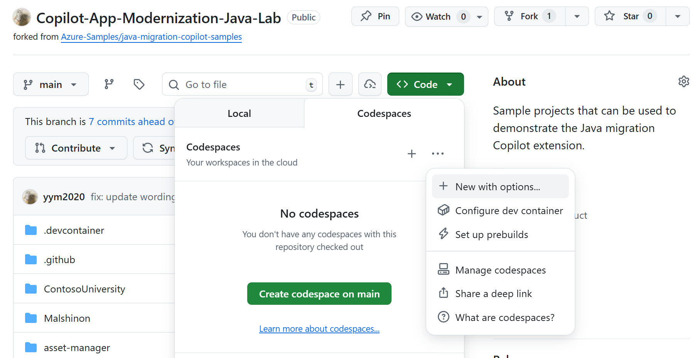

Important step: choose `...` (more options) -> `New with options...`.

On the configuration page:

- Branch: select `main`
- Dev Container Configuration: select `Java App Modernization Lab`
- Region: choose the closest region, such as `Southeast Asia` or `East US`
- Machine Type: choose `4-core`


Select `Create codespace`.

## Phase 3: Open the Codespace in Local VS Code (Recommended)

The browser experience works, but local VS Code provides a better Copilot workflow.

Wait for the cloud environment to finish initializing, usually 3 to 5 minutes.

After startup, click the `Codespaces` status item in the lower-left corner and choose `Open in VS Code Desktop`.


In the local VS Code window, verify that the lower-left corner shows `Codespaces: <name>`.

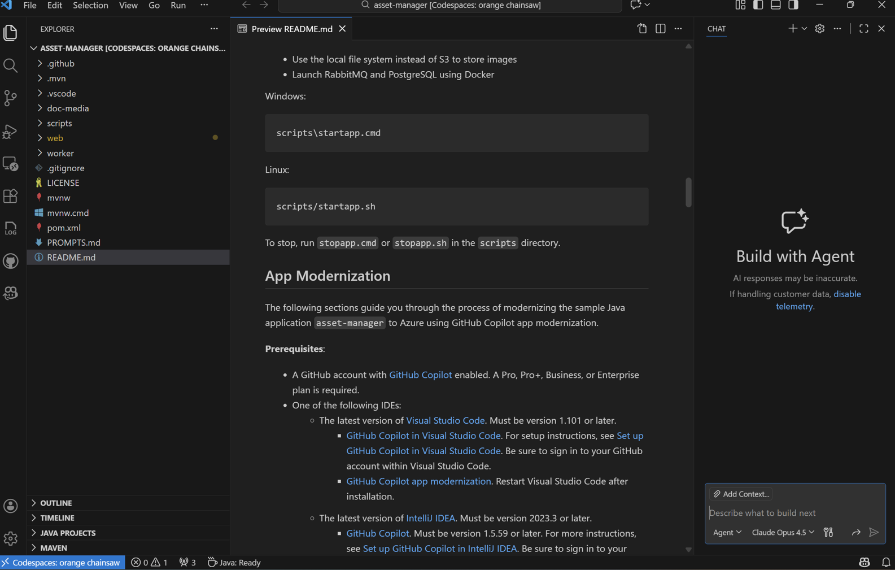

When the initial local VS Code prompt appears, select `No` as shown in the screenshot.

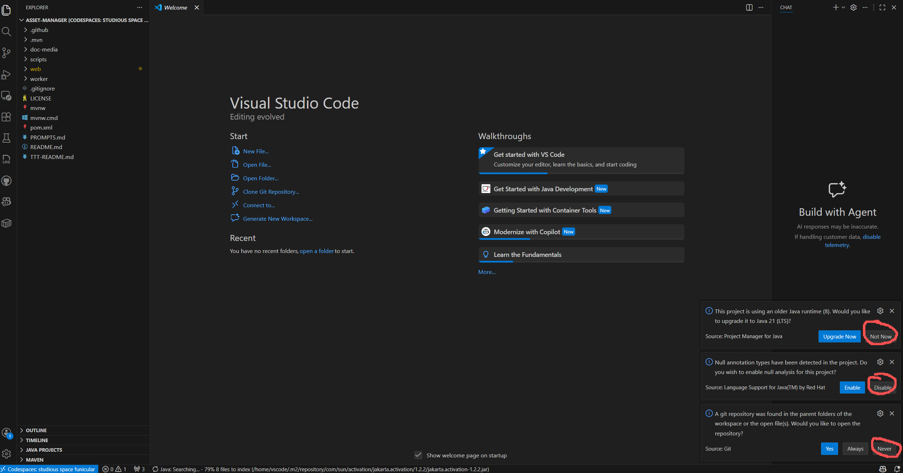

## Phase 4: Validate the Environment and Run the App

After startup, the environment runs initialization scripts automatically. Check the following items in the VS Code terminal.

### 1. Open the terminal

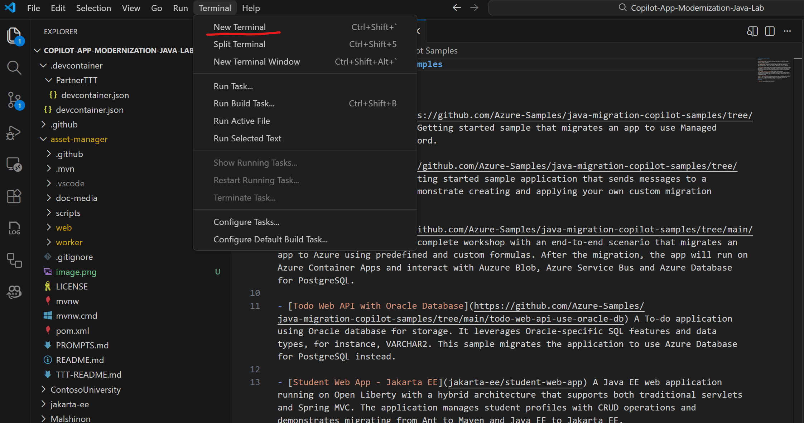

### 2. Verify tool versions

Run the following commands and confirm the expected versions:

- `java -version` should show `1.8.x`
- `mvn -version` should show `3.6.x` or later

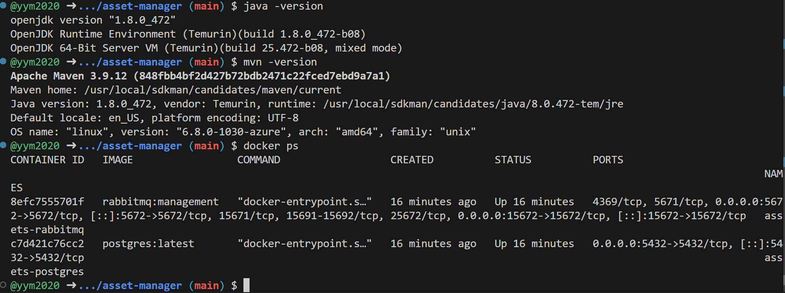

### 3. Start the baseline application

From the project directory, run:

```bash
./scripts/startapp.sh
```

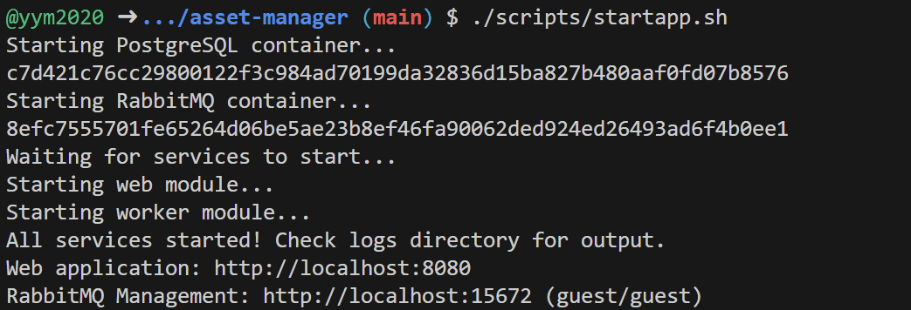

### 4. Access the application

Once the terminal shows a successful startup, open the VS Code Ports view and locate the mapped URL for the web application.

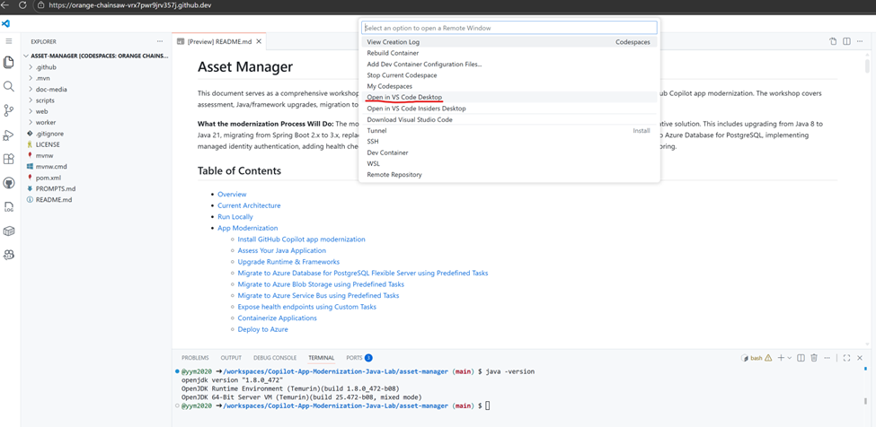

Open the URL to access the Asset Manager application.

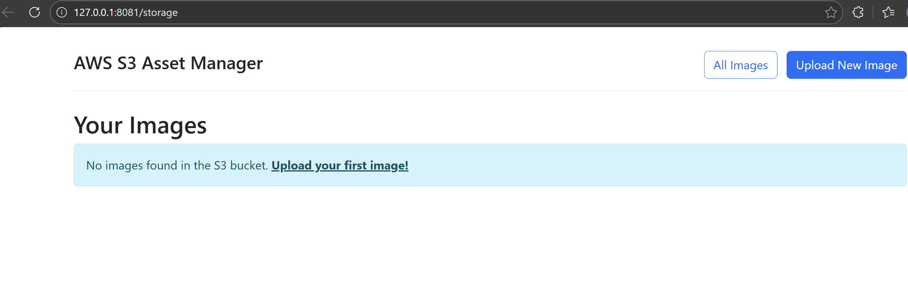

## Phase 5: Start the Modernization Workflow

At this point, the environment is ready for GitHub Copilot App Mod.

### 1. Run an assessment

Select the GitHub Copilot App Modernization icon in the left activity bar. Choose `Start Assessment`, then select `Custom Assessment`. In the `Custom Assessment` tab, enable `Security`, `Issues, Technologies & Dependencies`, and `Enable Containerization`. Then select `Run Assessment`.


### 2. Review assessment progress


### 3. Review results after about 8 minutes


### 4. Upgrade the Java runtime and framework (about 10 to 15 minutes)

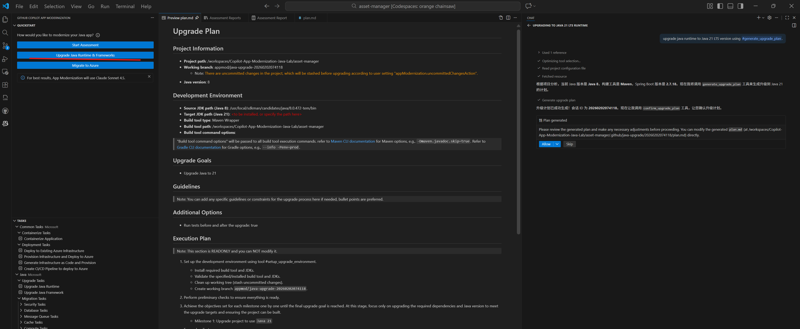

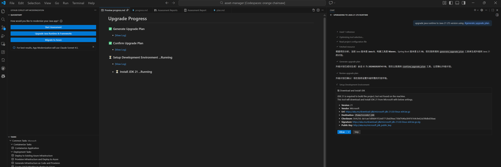

### 5. Review the upgrade report after completion

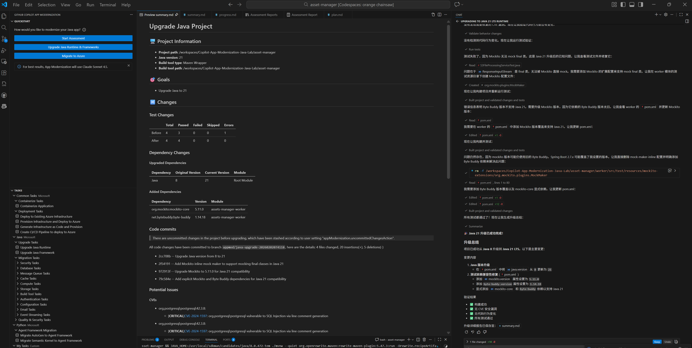

## Phase 6: Generate a Customized Assessment Report

The default App Mod assessment data is stored in `./.github/appmod/appcat`.


You can generate a customer-facing report from that assessment data. This repository already includes an English sample report prompt and sample output template files.


Add the generated assessment files `report.json` and `result.json`, plus the custom report prompt file `report-prompt-sample.en.md`, into Copilot Chat context. Then use an instruction such as: `Follow report-prompt-sample.en.md, use report-sample-new.en.html as the template, and generate a report named report.html`.


Example output:


---

# GH Copilot App Mod Java Modernization Lab Guide (Local Offline Distribution Edition)

This section supplements the Codespaces workflow above. Use it for workshop situations where GitHub access is unstable on site, but the attendee machine still has internet access and can use GitHub Copilot Chat normally.

This local workflow does not replace the Codespaces workflow. If attendees can use Codespaces reliably, follow the primary workflow. Use the local workflow only when GitHub repository access or Codespaces startup is unreliable.

## 1. Prepare the Local Machine

Before the workshop, ask attendees to complete the following setup on their local machine.

| Tool | Version Requirement | Purpose | Notes | Suggested Prompt |
|---|---|---|---|---|
| Visual Studio Code | Latest stable version | Main workshop interface | Required on both Windows and macOS | Help me install Visual Studio Code on my current OS and tell me how to verify the installed version. |
| GitHub Copilot | Copilot Business / Pro enabled | Used for environment checks and guided execution through Copilot Chat | Must sign in to GitHub in advance and confirm access | Help me check whether VS Code is already signed in to GitHub and whether GitHub Copilot and Copilot Chat are available. |
| JDK 8 | 1.8.x | Required to run the baseline legacy application | Eclipse Temurin 8 is recommended | Based on my operating system, help me install JDK 8, configure JAVA_HOME and PATH, and verify that java -version shows 1.8. |
| Docker Desktop | Latest stable version | Starts PostgreSQL and RabbitMQ | One of the key local runtime dependencies | Help me install Docker Desktop on my current OS, verify that Docker works, and show me how to run docker run hello-world. |
| VS Code Java Extension Pack | Latest stable version | Java project detection, build, and debugging | Extension Pack for Java is recommended | Help me install the required Java extensions in VS Code, including Extension Pack for Java, and show me how to verify that the Java project is recognized correctly. |
| GitHub Copilot Chat extension | Latest stable version | Enables natural-language setup guidance and checks | Recommended to verify separately | Help me verify that GitHub Copilot Chat is installed and enabled in VS Code, and guide me to install it if needed. |
| Java upgrade / modernization extensions | Latest stable version | Used for assessment and later modernization steps | Recommended to install ahead of time | Help me install the VS Code extensions needed for Java modernization and assessment, and show me how to confirm they are active. |

## 2. Tools That Do Not Need Separate Installation

| Tool | Required Separately | Why | Suggested Prompt |
|---|---|---|---|
| Maven | No | The repository already includes `mvnw` and `mvnw.cmd`, so Maven Wrapper is preferred | Check whether this project already includes Maven Wrapper and tell me whether I should use mvnw or a local Maven installation. |
| Git | No | If the workshop uses a zip package instead of git clone, Git is not required | If this workshop runs from an extracted zip package, tell me whether Git needs to be installed separately. |
| JDK 21 | Not as a prerequisite | This is the modernization target, not the starting requirement | Which JDK version is required to run the baseline code, and what is the upgrade target version? Tell me whether I need to install JDK 21 now. |

## 3. Operating System Notes

### Windows Attendees

- Verify first that Docker Desktop can be installed and started successfully.
- If virtualization, Hyper-V, or WSL2 is disabled by corporate policy, Docker Desktop may not work. This is the most common on-site blocker.
- On Windows, use `scripts\startapp.cmd` to start the application.
- If the terminal cannot detect Java after installation, check `JAVA_HOME` and `PATH` first.

Suggested prompt:

`Help me check whether this Windows machine satisfies Docker Desktop prerequisites, including virtualization, WSL2, and admin-permission risks.`

### macOS Attendees

- Install JDK 8 and Docker Desktop builds that match the machine architecture.
- On Apple Silicon, prefer native ARM builds.
- On macOS, use `./scripts/startapp.sh` to start the application.

Suggested prompt:

`Based on my Mac chip type, tell me which JDK 8 and Docker Desktop versions I should install and how to verify them.`

## 4. Open the Project Locally

1. Extract the workshop zip package to a local directory. Anonymous download link: https://filesharing0319153200.z13.web.core.windows.net/Copilot-App-Modernization-Java-Lab-main.zip
2. Open Visual Studio Code.
3. Select `File -> Open Folder` and open the extracted `asset-manager` directory.
4. Wait for VS Code to finish loading the Java project.
5. Open Copilot Chat and start with a local environment check.

Recommended initial prompt:

`This is a Java Maven project. First, help me verify whether my local machine is ready to run it, including JDK, Docker, VS Code Java extensions, and Copilot Chat.`

## 5. Copilot Chat Setup Guidance

Instructors should encourage attendees to use Copilot Chat for installation guidance and environment checks whenever possible.

Recommended sequence:

1. Install and verify VS Code.
2. Sign in to GitHub and enable Copilot / Copilot Chat.
3. Install JDK 8 and configure `JAVA_HOME`.
4. Install Docker Desktop and run `docker run hello-world`.
5. Install Java-related VS Code extensions.
6. After opening the project, let Copilot Chat run a full environment check.

Prompts that attendees can use directly:

### 1. Full environment check

`This is a Java modernization workshop project. Check whether my local environment meets the runtime requirements and tell me what is still missing in priority order.`

### 2. JDK 8 installation check

`Help me confirm whether JDK 8 is already installed on this system. If not, guide me through the installation and tell me how to verify that java -version shows 1.8.`

### 3. Docker installation check

`Help me check whether Docker Desktop is installed and running correctly. If not, tell me what to do next.`

### 4. VS Code Java extensions check

`Help me check whether the required Java extensions are installed in VS Code and tell me which ones are missing.`

### 5. Copilot availability check

`Help me confirm whether GitHub Copilot and Copilot Chat are enabled successfully in my current VS Code.`

## 6. Validate and Run the Local Environment

After setup is complete, verify the environment as follows:

1. Open the terminal in VS Code.
2. Run the following commands.

Windows:

```bat
java -version
docker --version
scripts\startapp.cmd
```

macOS:

```bash
java -version
docker --version
chmod +x ./scripts/startapp.sh
./scripts/startapp.sh
```

3. After the application starts, open the following URLs:

- Web app: `http://localhost:8080`
- RabbitMQ management UI: `http://localhost:15672` with `guest/guest`

4. If startup fails, send the terminal error output to GitHub Copilot Chat first.

Suggested prompt:

`I am running this Java workshop project and the startapp script failed. Based on the terminal error, help me determine whether the issue comes from JDK, Docker, PostgreSQL, or RabbitMQ.`

## 7. Start Assessment and Modernization

After the local environment is ready, the remaining workshop steps are nearly the same as in the Codespaces workflow:

1. Open the GitHub Copilot App Modernization entry in the activity bar.
2. Start the assessment.
3. Review the assessment results.
4. Execute the Java runtime and framework upgrade.
5. Generate and customize the assessment report.

## 8. Troubleshooting Guidance

If attendees run into environment installation issues, project startup failures, extension recognition problems, assessment entry issues, or runtime errors, ask them to send the terminal output, error details, and current workspace context to GitHub Copilot Chat first. That gives the fastest path to the next action.

General prompt:

`Act as the on-site assistant for this Java workshop. Based on my current terminal output, error message, and workspace contents, prioritize the issue and tell me the next single action I should take.`