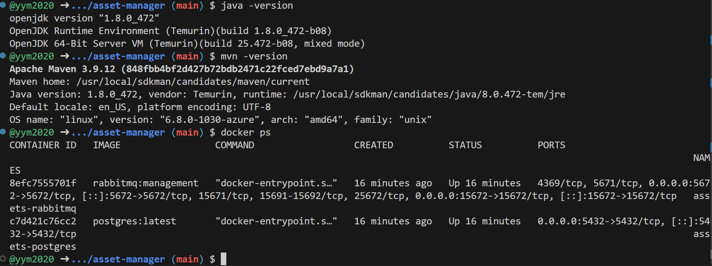
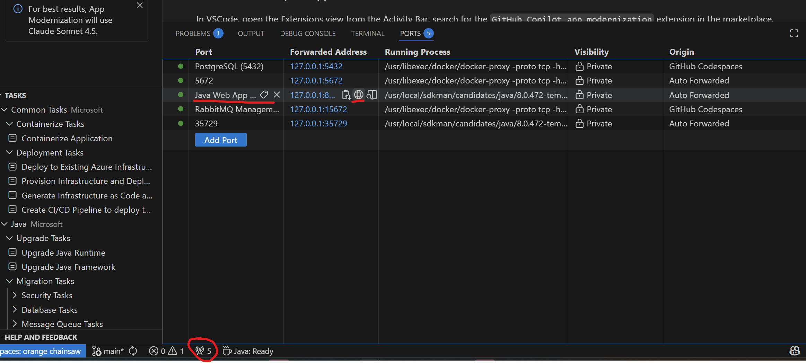
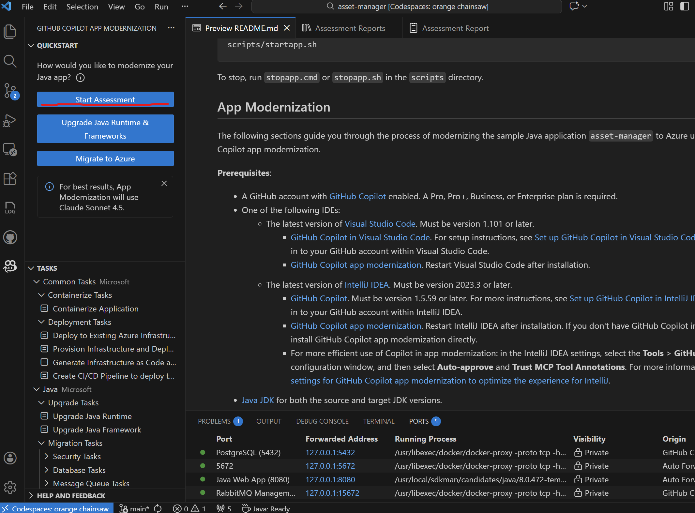
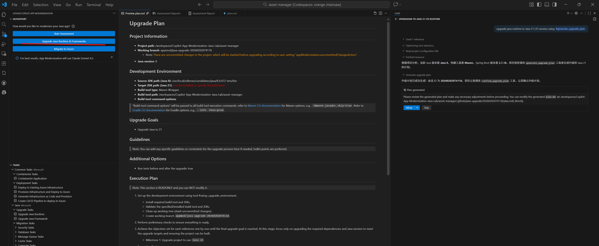

🚀 GH Copilot App Mod Java 应用现代化实验指南 (GitHub Codespaces 版)

欢迎参加 GitHub Copilot App Modernization 实验！本实验将带你把一个基于 Java 8 的遗留应用（Asset Manager）迁移到现代化的云原生架构。

为了避免每个人本地计算机环境的差异带来的挑战，我们将全程使用 GitHub Codespaces。

🛠️ 第一阶段：准备工作 (实验前必做)

在启动环境之前，请确保你已经完成了以下配置：

GitHub 账号权限：

确保你的账号拥有 GitHub Copilot Business 或 Copilot Pro 等更高权限。

本地软件安装：

安装 Visual Studio Code。

在 VS Code 插件市场搜索并安装 GitHub Codespaces 扩展。

网络环境：

建议实验过程中保持网络稳定。如果实验过程中使用 WiFi 遇到连接断开，请尝试使用手机热点。

🏗️ 第二阶段：启动实验环境

我们将通过云端容器启动一个预装了 JDK 8、Maven 3.6+ 和 Docker 的标准化环境。

Fork代码仓库：https://github.com/yym2020/Copilot-App-Modernization-Java-Lab 到你的Github账户中，**注意请勿修改代码库名称**

点击绿色按钮 <> Code，切换到 Codespaces 选项卡。

关键步骤：点击 ... (更多选项) -> New with options...。

在配置页面：

Branch: 选择 main。

Dev Container Configuration: 务必选择 Java App Modernization Lab。

Region: 选择距离你最近的区域（如 Southeast Asia 或 East US）。

Machine Type: 选择2-core

点击 Create codespace。

💻 第三阶段：连接到本地 VS Code (推荐)
虽然浏览器可以运行，但在本地 VS Code 中操作会有更好的 Copilot 体验。

等待云端环境初始化（约 2-3 分钟）。

环境启动后，点击左下角的 "Codespaces" 绿色状态栏，选择 "Open in VS Code"。

在本地弹出的 VS Code 窗口中，确认左下角显示 Codespaces: <名称>。

✅ 第四阶段：环境验证与运行
环境启动后，它会自动执行初始化脚本。请在 VS Code 终端中检查：

1. 验证版本信息
输入以下命令，确认环境是否正确：

java -version (应显示为 1.8.x)

mvn -version (应显示为 3.6.x 或更高)

docker ps (你应该能看到 postgres 和 rabbitmq 两个容器正在运行)

2. 运行初始应用
在终端中进入项目目录并构建：

scripts/startapp.sh

3. 访问应用
当终端显示应用启动成功后，在VS Code端口界面中找到对应Web 应用在本地映射的路径

点击进入访问Asset manager应用

🤖 第五阶段：开始应用现代化 (AI 介入)
现在，你已经准备好使用 GitHub Copilot App Mod 进行代码改造了！

点击左侧栏Github Copilot App Moddernization图标，点击Start Assessment启动对代码库的评估

查看评估过程

大约5分钟后，查看评估结果

升级Java Runtime & Framework

升级完成，查看升级报告：

在Terminal中输入命令检查应用所使用的Java版本：
cd /workspaces/Copilot-App-Modernization-Java-Lab/asset-manager && ./mvnw help:evaluate -Dexpression=java.version -q -DforceStdout && echo

